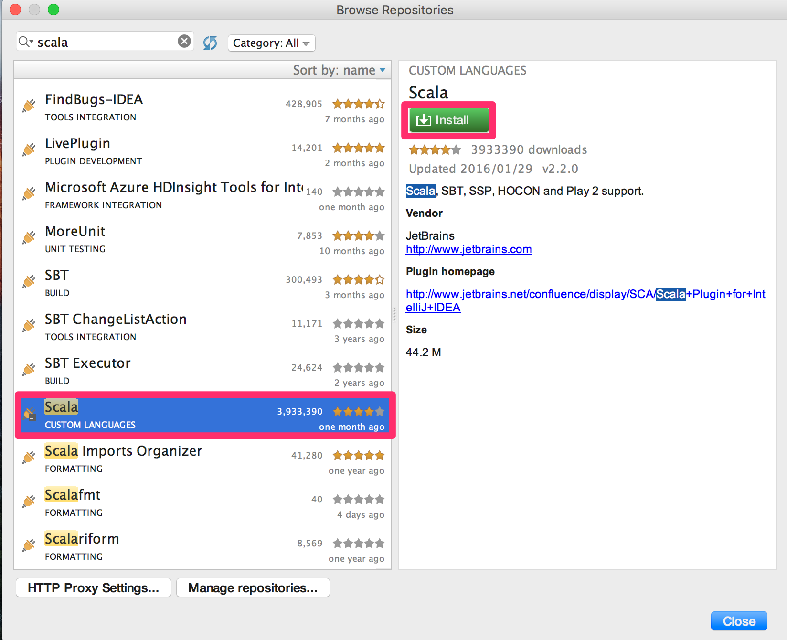
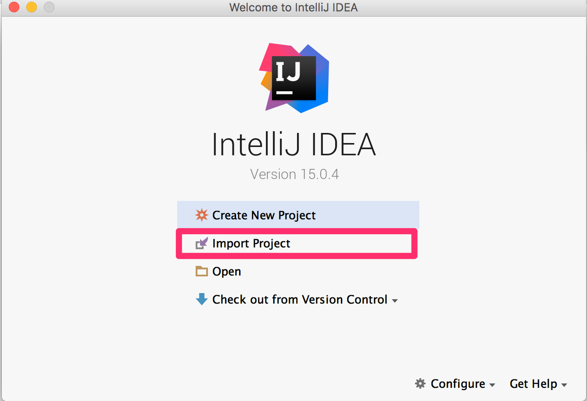
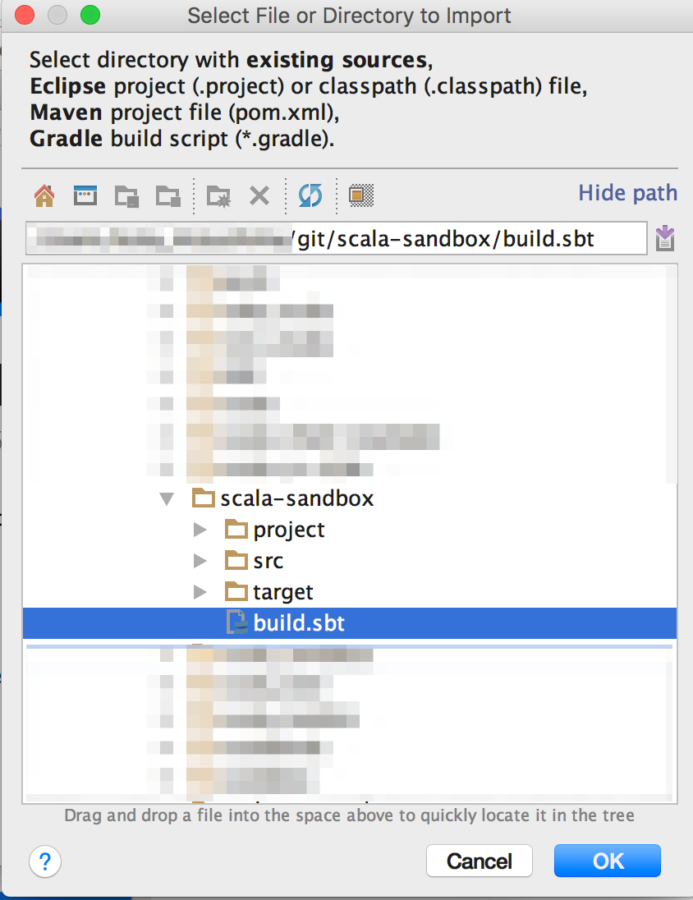
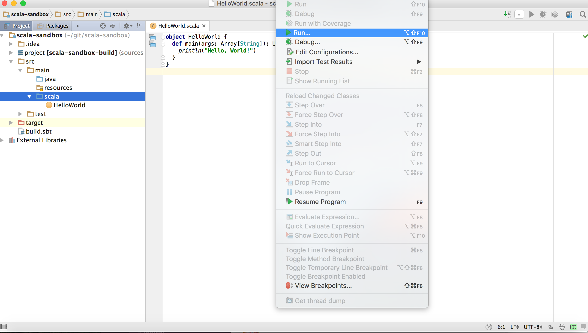

# IDE (Integrated Development Environment)

Scalaで本格的にコーディングする際は、エディタ（Emacs, Vim, Sublime Text）を使っても構いませんが、
IDEを使うとより開発が楽になります。Scalaで開発する際のIDEとしてはIntelliJ IDEA + Scala Pluginと
Scala IDE for Eclipseの2種類がありますが、IntelliJ IDEAの方がIDEとして高機能であり、安定性も高い
ため、ここではIntelliJ IDEA + Scala Pluginのインストール方法と基本的な操作について説明します。

補足：なお、本節でIDEをインストール後も説明は**REPLを使って行います**が、IDEベースで学習したい場合は
適宜コードをIDEのエディタに貼り付けて実行するなどしてください。

IntelliJ IDEAは[JetBrains社](https://www.jetbrains.com/)が開発しているIDEで、Java用
IDEとして根強い人気を誇っています。有料ですが多機能のUltimate Editionやオープンソース
で無料のCommunity Editionがあります。Community Editionでも、Scalaプラグインをインストール
することでScala開発をすることができるので、本稿ではCommunity Editionをインストール
してもらいます。

まず、IntelliJ IDEAの[Downloadページ](https://www.jetbrains.com/idea/download/)に
移動します。Windows, Mac OS X, Linuxの3つのタブがあるので、それぞれのOSに応じた
タブを選択して、「Download Community」ボタンをクリックしてください。以降、IDEAの
スクリーンショットがでてきますが、都合上、Mac OS X上でのスクリーンショットである
ことをご承知ください。


ボタンをクリックすると、`ideaIC-${version}.dmg`（`${version}`はその時点でのIDEAのバージョン）という
ファイルのダウンロードが始まるので（Windowsの場合、インストーラのexeファイル）、ダウンロードが終わるのを
待ちます。ダウンロードが終了したら、ファイルをダブルクリックして、指示にしたがってインストールします。


インストールが終わったら起動します。スプラッシュスクリーンが現れてしばらく待つと、


のような画面が表示されるはずです。ここまでで、IDEAのインストールは完了です。次に、IDEAの
Scalaプラグインをインストールする必要があります。起動画面の`Configure->Plugins`を
クリックしてください。


次のような画面が現れるので、その中の「Browse repositories」をクリックします。


インストール可能なプラグインの一覧が現れるので、検索窓から`scala`で絞り込みを
かけて、「Install」でインストールします（スクリーンショット参照）



Scalaプラグインのダウンロード・インストールには若干時間がかかるのでしばらく待ちます。
ダウンロード・インストールが完了したら、次のような画面が現れるので、「Restart IntelliJ IDEA」
をクリックします。


再起動後、起動画面で「Create New Project」をクリックし、次の画面のようになっていればインストール
は成功です。


## sbtプロジェクトのインポート

次に、単純なsbtプロジェクトをIntelliJ IDEAにインポートしてみます。今回は、あらかじめ用意して
おいた`scala-sandbox`プロジェクトを使います。`scala-sandbox`プロジェクトは
[ここ](https://github.com/dwango/scala-sandbox)から`git clone`でcloneします。
`scala-sandbox`プロジェクトは次のような構成になっているはずです。

```
scala-sandbox
├── src/main/scala/HelloWorld.scala
├── project/build.properties
└── build.sbt

```

この`scala-sandbox`ディレクトリをプロジェクトとしてIntelliJ IDEAに取り込みます。

まず、IntelliJ IDEAの起動画面から、「Import Project」を選択します。



次に、以下のような画面が表示されるので、build.sbtをクリックして、OKします。



すると、さらに次のような画面が表示されます。「Project SDK」が空の場合がありますが、その場合は、「New」を選択して自分で、JDKのホームディレクトリにあるJDKを指定します。


最後に、OKします。最初は、sbt自体のソースを取得などするため時間がかかりますが、しばらく待つとプロジェクト画面が開きます。
そこから、_HelloWorld.scala_を選んでダブルクリックして、以下のように表示されれば成功です。


このように、IntelliJ IDEAでは、sbtのプロジェクトをインポートしてIDE内で編集することができます。

## プログラムを実行する

最後に、このHelloWorldプログラムを実行します。_HelloWorld.scala_をIDEのエディタで開いた状態でメニューから`Run -> Run`と選択します。



次のような画面が現れるので、**Hello World**を選択します。


すると、Hello Worldプログラムの最初のコンパイルが始まるので少し待ちます。その後、次のような画面が表示されたら成功です。


なお、ここではIntelliJ IDEAのセットアップ方法のみを説明しましたが、最近安定性と機能が向上した[Scala IDE for Eclipse](http://scala-ide.org/)
を試してみても良いかもしれません。
