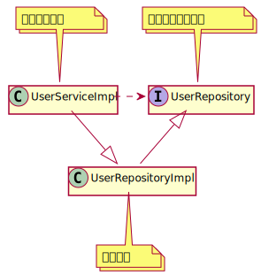
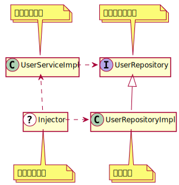

# トレイトの応用編：依存性の注入によるリファクタリング

ここではトレイトの応用編として、大きなクラスをリファクタリングする過程を通してトレイトを実際どのように使っていくかを学んでいきましょう。
さらに大規模システム開発で使われる依存性の注入という技法についても紹介します。

## サンプルプログラム

今回使われるサンプルプログラムは以下の場所にあります。
実際に動かしたい場合は個々のディレクトリに入り、sbtを起動してください。

[リファクタリング前のプログラム](https://github.com/scala-text/scala_text/tree/master/src/example_projects/trait-example)

[リファクタリング後のプログラム](https://github.com/scala-text/scala_text/tree/master/src/example_projects/trait-refactored-example)

## リファクタリング前のプログラムの紹介

今回は今までより実践的なプログラムを考えてみましょう。
ユーザーの登録と認証を管理する`UserService`というクラスです。

[include](./example_projects/trait-example/build.sbt)

[include](./example_projects/trait-example/src/main/scala/domain/User.scala)

[include](./example_projects/trait-example/src/main/scala/domain/UserService.scala)

`UserService`は以下のような機能があります。

- `register`メソッドはユーザーの登録をおこなうメソッドで、ユーザーの名前とパスワードを引数として受け取り、名前の最大長のチェックと既に名前が登録されているかどうかを調べて、ストレージに保存する
- `login`メソッドはユーザーの認証をおこなうメソッドで、ユーザーの名前とパスワードを受け取り、ストレージに保存されているユーザーの中から同名のユーザーを見つけ出し、パスワードをチェックする
- この他のストレージ機能とパスワード機能のメソッドは内部的に使われるのみである

上記のプログラムでは実際に動かすことができるように[ScalikeJDBC](https://github.com/scalikejdbc/scalikejdbc)というデータベース用のライブラリとjBCryptというパスワースのハッシュ値を計算するライブラリが使われていますが、実装の詳細を理解する必要はありません。
既にメソッドの実装を説明したことがある場合は実装を省略し[`???`](https://github.com/scala/scala/blob/v2.13.9/src/library/scala/Predef.scala#L344)で書くことがあります。

## リファクタリング：公開する機能を制限する

さて、モジュール化という観点で`UserService`を見ると、どういった問題が考えられるでしょうか？

1つはUserServiceが必要以上に情報を公開しているということです。
`UserService`の役割は`register`メソッドを使ったユーザー登録と`login`メソッドを使ったユーザーの認証です。
しかしストレージ機能である`insert`メソッドや`find`メソッドも公開してしまっています。

`register`メソッドはユーザーの名前の最大長や既にユーザーが登録されているかどうかチェックしていますが、`insert`メソッドはそういったチェックをせずにデータベースに保存しています。
もし`insert`メソッドを直接使われた場合、想定外に名前が長いユーザーや、名前が重複したユーザーが保存されてしまいます。

`find`メソッドも同様の問題があります。
`login`メソッドではなく直接`find`メソッドが使われた場合、パスワードのチェックなしにユーザーの情報を取得することができます。

では、どのような修正が考えられるでしょうか。まず考えられるのは外部から使ってほしくないメソッドを`private`にすることです。

```scala
class UserService {
  // メソッドの実装は同じなので???で代用しています
  val maxNameLength = 32

  // ストレージ機能
  private[this] def insert(user: User): User = ???

  private[this] def createUser(rs: WrappedResultSet): User = ???

  private[this] def find(name: String): Option[User] = ???

  private[this] def find(id: Long): Option[User] = ???

  // パスワード機能
  private[this] def hashPassword(rawPassword: String): String = ???

  private[this] def checkPassword(rawPassword: String, hashedPassword: String): Boolean = ???

  // ユーザー登録
  def register(name: String, rawPassword: String): User = ???

  // ユーザー認証
  def login(name: String, rawPassword: String): User = ???
}
```

これで`insert`メソッドや`find`メソッドは外部から呼びだすことができなくなったので、先ほどの問題は起きなくなりました。

しかしトレイトを使って同じように公開したい機能を制限することもできます。
まず、公開するメソッドだけを集めた新しいトレイト`UserService`を作ります。

```scala
trait UserService {
  val maxNameLength = 32

  def register(name: String, rawPassword: String): User

  def login(name: String, rawPassword: String): User
}
```

そして、このトレイトの実装クラス`UserServiceImpl`を作ります。

```scala
class UserServiceImpl extends UserService {
  // メソッドの実装は同じなので???で代用しています

  // ストレージ機能
  def insert(user: User): User = ???

  def createUser(rs: WrappedResultSet): User = ???

  def find(name: String): Option[User] = ???

  def find(id: Long): Option[User] = ???

  // パスワード機能
  def hashPassword(rawPassword: String): String = ???

  def checkPassword(rawPassword: String, hashedPassword: String): Boolean = ???

  // ユーザー登録
  def register(name: String, rawPassword: String): User = ???

  // ユーザー認証
  def login(name: String, rawPassword: String): User = ???
}
```

`UserService`の利用者は実装クラスではなく公開トレイトのほうだけを参照するようにすれば、チェックされていないメソッドを使って不整合データができてしまう問題も起きません。

このようにモジュールのインタフェースを定義し、公開する機能を制限するのもトレイトの使われ方の1つです。
Javaのインタフェースと同じような使い方ですね。

### リファクタリング：大きなモジュールを分割する

次にこのモジュールの問題点として挙げられるのは、モジュールが多くの機能を持ちすぎているということです。
`UserService`はユーザー登録とユーザー認証をおこなうサービスですが、付随してパスワードをハッシュ化したり、パスワードをチェックする機能も持っています。

このパスワード機能は`UserService`以外でも使いたいケースが出てくるかもしれません。
たとえばユーザーが重要な操作をした場合に再度パスワードを入力させ、チェックしたい場合などです。

このような場合、1つのモジュールを複数のモジュールに分割することが考えられます。
あたらしくパスワード機能だけを持つ`PasswordService`と`PasswordServiceImpl`を作ってみます。

[include](./example_projects/trait-refactored-example/src/main/scala/domain/PasswordService.scala)

そして、先ほど作った`UserServiceImpl`に`PasswordServiceImpl`を継承して使うようにします。

```scala
class UserServiceImpl extends UserService with PasswordServiceImpl {
  // メソッドの実装は同じなので???で代用しています

  // ストレージ機能
  def insert(user: User): User = ???

  def createUser(rs: WrappedResultSet): User = ???

  def find(name: String): Option[User] = ???

  def find(id: Long): Option[User] = ???

  // ユーザー登録
  def register(name: String, rawPassword: String): User = ???

  // ユーザー認証
  def login(name: String, rawPassword: String): User = ???
}
```

これでパスワード機能を分離することができました。
分離したパスワード機能は別の用途で使うこともできるでしょう。

同じようにストレージ機能も`UserRepository`として分離してみます。

[include](./example_projects/trait-refactored-example/src/main/scala/domain/UserRepository.scala)

すると、UserServiceImplは以下のようになります。

```scala
class UserServiceImpl extends UserService with PasswordServiceImpl with UserRepositoryImpl {
  // メソッドの実装は同じなので???で代用しています

  // ユーザー登録
  def register(name: String, rawPassword: String): User = ???

  // ユーザー認証
  def login(name: String, rawPassword: String): User = ???
}
```

これで大きな`UserService`モジュールを複数の機能に分割することできました。

## 依存性の注入によるリファクタリング

さて、いよいよこの節の主題である依存性の注入によるリファクタリングの話に入りましょう。

ここまでトレイトを使って公開する機能を定義し、モジュールを分割し、リファクタリングを進めてきましたが、`UserService`にはもう1つ大きな問題があります。
モジュール間の依存関係が分離できていないことです。

たとえば`UserServiceImpl`のユニットテストをすることを考えてみましょう。
ユニットテストは外部のシステムを使わないので、ローカル環境でテストしやすく、並行して複数のテストをすることもできます。
また、単体の機能のみをテストするため失敗した場合、問題の箇所がわかりやすいという特徴もあります。

`UserServiceImpl`は`UserRepositoryImpl`に依存しています。
`UserRepositoryImpl`はScalikeJDBCを使った外部システムであるデータベースのアクセスコードがあります。
このままの`UserServiceImpl`でユニットテストを作成した場合、テストを実行するのにデータベースを用意しなければならず、データベースを共用する場合複数のテストを同時に実行するのが難しくなります。
さらにテストに失敗した場合`UserServiceImpl`に原因があるのか、もしくはデータベースの設定やテーブルに原因があるのか、調査しなければなりません。
これではユニットテストとは言えません。

そこで具体的な`UserRepositoryImpl`への依存を分離することが考えられます。
このために使われるのが依存性の注入と呼ばれる手法です。

### 依存性の注入とは？

まずは一般的な「依存性の注入（Dependency Injection、DI）」の定義を確認しましょう。

依存性の注入についてWikipediaの[Dependency injectionの項目](https://en.wikipedia.org/wiki/Dependency_injection)を見てみますと、

- Dependencyとは実際にサービスなどで使われるオブジェクトである
- InjectionとはDependencyを使うオブジェクトに渡すことである

とあります。さらにDIには以下の4つの役割が登場するとあります。

- 使われる対象の「サービス」
- サービスを使う（依存する）「クライアント」
- クライアントがどうサービスを使うかを定めた「インタフェース」
- サービスを構築し、クライアントに渡す「インジェクタ」

これらの役割について、今回の例の`UserRepository`、`UserRepositoryImpl`、`UserServiceImpl`で考えてみます。
Wikipedia中の「サービス」という用語と、これまでの例の中で登場するサービスという言葉は別の意味なので注意してください。

まずはDIを使っていない状態のクラス図を見てみましょう。



<!---
```
@startuml

Interface UserRepository
Class UserRepositoryImpl
Class UserServiceImpl

note top of UserRepository : インタフェース
note bottom of UserRepositoryImpl : サービス
note top of UserServiceImpl : クライアント

hide members

UserRepositoryImpl -u-|> UserRepository
UserServiceImpl .r.> UserRepository
UserServiceImpl --|> UserRepositoryImpl

@enduml
```
-->

このクラス図の役割を表にしてみます。

| DIの役割 | コード上の名前 | 説明 |
|----------|----------------|------|
| インタフェース | UserRepository | 抽象的なインタフェース |
| サービス | UserRepositoryImpl | 具体的な実装 |
| クライアント | UserServiceImpl | UserRepositoryの利用者 |

DIを使わない状態では`UserRepository`というインタフェースが定義されているのにもかかわらず、`UserServiceImpl`は`UserRepositoryImpl`を継承することで実装も参照していました。
これではせっかくインタフェースを分離した意味がありません。
`UserServiceImpl`が`UserRepository`インタフェースだけを参照（依存）するようにすれば、具体的な実装である`UserRepositoryImpl`の変更に影響されることはありません。
この問題を解決するのがDIの目的です。

それではDIのインジェクタを加えて、上記のクラス図を修正しましょう。



<!---
```
@startuml

Interface UserRepository
Class UserRepositoryImpl
Class UserServiceImpl
Class Injector << (?, #ffffff) >>

note top of UserRepository : インタフェース
note bottom of UserRepositoryImpl : サービス
note top of UserServiceImpl : クライアント
note bottom of Injector : インジェクタ

hide members

UserRepositoryImpl -u-|> UserRepository
UserServiceImpl .r.> UserRepository
Injector .r.> UserRepositoryImpl
Injector ..> UserServiceImpl

@enduml
```
-->

謎のインジェクタの登場により`UserServiceImpl`から`UserRepositoryImpl`への参照がなくなりました。
おそらくインジェクタは何らかの手段でサービスである`UserRepositoryImpl`（Dependency）をクライアントである`UserServiceImpl`に渡しています（Injection）。
このインジェクタの動作を指して「Dependency Injection」と呼ぶわけです。
そして、このインジェクタをどうやって実現するか、それがDI技術の核心に当たります。

### 依存性の注入の利点

では、この依存性の注入を使うとどのような利点があるのでしょうか。

1つはクライアントがインタフェースだけを参照することにより、具体的な実装への参照が少なくなり **コンポーネント同士が疎結合になる** という点が挙げられます。
たとえば`UserRepositoryImpl`のクラス名やパッケージ名が変更されても`UserServiceImpl`には何の影響もなくなります。

次に挙げられる点は具体的な実装を差し替えることにより **クライアントの動作がカスタマイズ可能** になるという点です。
たとえば今回の例では`UserRepositoryImpl`はScalikeJDBCの実装でしたが、MongoDBに保存する`MongoUserRepositoryImpl`を新しく作って`UserServiceImpl`に渡せばクライアントをMongoDBに保存するように変更することができます。

またDIは設計レベルでも意味があります。
DIを使うと **依存関係逆転の原則を実現できます** 。
通常の手続き型プログラミングでは、上位のモジュールから下位の詳細な実装のモジュールを呼ぶということがしばしばあります。
しかし、この場合、上位のモジュールが下位のモジュールに依存することになります。
つまり、下位の実装の変更が上位のモジュールにまで影響することになってしまうわけです。

依存関係逆転の原則というのは、上位のモジュールの側に下位のモジュールが実装すべき抽象を定義し、下位のモジュールはその抽象に対して実装を提供すべきという考え方です。
たとえば`UserService`が上位のモジュールだとすると、`UserRepositoryImpl`は下位のモジュールになります。
依存関係逆転をしない場合、`UserService`から直接`UserRepositoryImpl`を呼ばざるをえません。
このままだと先ほど述べたような問題が生じてしまうので、依存関係逆転の原則に従って、上位のモジュールに抽象的な`UserRepository`を用意し、`UserService`は`UserRepository`を使うようにします。
そして、依存性の注入によって、下位のモジュールの`UserRepositoryImpl`を`UserService`に渡すことにより、このような問題を解決できるわけです。

また見落されがちな点ですが、DIでは **クライアントに特別な実装を要求しない** という点も重要です。
これはJava界隈でDIが登場した背景に関連するのですが、Spring FrameworkなどのDIを実現するDIコンテナは複雑なEnterprise JavaBeans(EJB)に対するアンチテーゼとして誕生しました。
複雑なEJBに対し、何も特別でないただのJavaオブジェクトであるPlain Old Java Object(POJO)という概念が提唱され、わかりやすさや、言語そのものの機能による自由な記述が重視されました。
DIの登場にはそのような背景があり、クライアントに対して純粋な言語機能以外求められないことが一般的です。

最後に、先ほども触れましたが **依存オブジェクトのモック化によるユニットテストが可能になる** という点です。
たとえばWebアプリケーションについて考えると、Webアプリケーションは様々な外部システムを使います。
WebアプリケーションはMySQLやRedisなどのストレージを使い、TwitterやFacebookなどの外部サービスにアクセスすることもあるでしょう。
また刻一刻と変化する時間や天候などの情報を使うかもしれません。
このような外部システムが関係するモジュールはユニットテストすることが困難です。
DIを使えば外部システムの実装を分離できるので、モックに置き換えて、楽にテストできるようになります。

以上、DIの利点を見てきました。
実装オブジェクト（Dependency）を取得し、サービスに渡す（Injection）という役割をするだけのインジェクタの登場により様々なメリットが生まれることが理解できたと思います。
DIは特に大規模システムの構築に欠かせない技術であると言っても過言ではないと思います。
