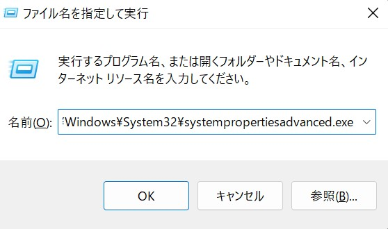

# sbtをインストールする

現実のScalaアプリケーションでは、Scalaプログラムを手動でコンパイル[^scalac]することは非常に稀で、
標準的なビルドツールである[sbt](https://www.scala-sbt.org)というツールを用いることになり
ます。ここでは、sbtのインストールについて説明します。

## SDKMAN!のインストール

ここでは、sbtとJavaのいずれも[SDKMAN!](https://sdkman.io/)を利用したインストール方法を紹介します。
Mac OSやLinuxの場合、SDKMAN!は以下のコマンドでインストールできます。

```shell
$ curl -s "https://get.sdkman.io" | bash      # SDKMAN!のインストール
$ source "$HOME/.sdkman/bin/sdkman-init.sh"   # SDKMAN!の初期化（shellの再起動でも可）
$ sdk version                                 # パスが通っているかの確認
```

Windowsの場合も[WSL](https://docs.microsoft.com/en-us/windows/wsl/install)から同様の方法でインストールすることが可能です。

## Javaのインストール

Scala 2.12や2.13ではJava 8以降が必須なので、もしJavaがインストールされていなければ、まずJavaをインストールしましょう。
ScalaとJavaのそれぞれのバージョンの互換性に関しては、以下のScala公式サイトのページを見てください。

https://docs.scala-lang.org/overviews/jdk-compatibility/overview.html

ここでは、先ほどインストールしたSDKMAN!を利用する方法を紹介します。[^m1mac-jdk]

```shell
$ sdk list java                 # インストールできるJavaの一覧を確認
# sdk install java <Identifier> # <Identifier> の部分は上記のコマンドで確認した中からインストールしたいものを入れる
$ sdk install java 11.0.15-tem  # 例
$ java -version                 # Javaがインストールされているかの確認（Java8以前の場合）
$ java --version                # Javaがインストールされているかの確認（Java11以降の場合）
```

## Mac OS, Linux, WSL（Windows） の場合

最初にインストールしたSDKMAN!を利用してsbtをインストールします。

```shell
$ sdk install sbt # sbtのインストール
$ which sbt       # sbtがインストールされているかの確認
```

とすれば、sbtがインストールできます。

### Homebrewを利用する方法（Mac OS）

[Homebrew](https://brew.sh/index_ja.html)を用いる方法でも可能です。

```shell
$ brew install sbt
```

でインストールでき、楽ですが、新しすぎるJDKがインストールされてしまうという問題があります。 https://github.com/scala-text/scala_text/issues/566

## Windowsの場合（WSL以外）

WindowsでWSLを利用しない場合は、以下の方法でsbtをインストールすることができます。

Windows公式のwingetコマンド、あるいは[chocolatey](https://chocolatey.org/)コマンドを使ってインストールすると楽です。

`winget`を使う場合はWindows Powershellを開いてください。`winget search`コマンドで最新のバージョンを確認できます。 

```
winget search sbt
sbt  sbt.sbt <latest version>      winget
```

あとは`winget install sbt -v <version>`コマンドで指定したバージョンのsbtをインストールできます。

chocolateyはWindows用のパッケージ マネージャで活発に開発が行われてます。chocolatey
のパッケージにはsbtのものもあるので、

```
> choco install sbt
```

とすればWindowsにsbtがインストールされます。

Windows/Mac OSの場合で、シェル環境でsbtと入力するとバイナリのダウンロードが
始まればインストールの成功です。sbtがないと言われる場合、環境変数へsbtへのPATHが
通っていないだけですので追加しましょう。Windowsの環境変数は「システムのプロパティ」から編集できます。

Windowsキーとrキーを同時に押して`C:\Windows\System32\systempropertiesadvanced.exe`を入力します。




これが上手くいかない場合は、Windowsキーとrキーを同時に押し、`sysdm.cpl`を入力して「システムのプロパティ」画面を開きます。

「システムのプロパティ」の「詳細設定」のタブを開き、ウィンドウの下の方にある「環境変数」ボタンを押して環境変数の設定画面を開きます。

環境変数に`PATH`が存在する場合は、`PATH`を編集してsbtのインストール先（例えば`C:\sbt\bin`）を追加します。環境変数に`PATH`が存在しない場合は新しく`PATH`環境変数を追加して同じくsbtのインストール先を指定します。

## REPLとsbt

これからしばらく、REPL（Read Eval Print Loop）機能と呼ばれる対話的な機能を用いてScalaプログラムを
試していきますが、それは常に`sbt console`コマンドを経由して行います。

sbt consoleを起動するには、WindowsでもMacでも

```
$ sbt console
```

と入力すればOKです。成功すれば、

```
[info] Loading global plugins from /Users/.../.sbt/1.0/plugins
[info] Set current project to sandbox (in build file:/Users/.../sandbox/)
[info] Updating {file:/Users/.../sandbox/}sandbox...
[info] Resolving org.fusesource.jansi#jansi;1.4 ...
[info] Done updating.
[info] Starting scala interpreter...
[info] 
Welcome to Scala version 2.13.10 (Java HotSpot(TM) 64-Bit Server VM, Java 1.8.0_45).
Type in expressions to have them evaluated.
Type :help for more information.

scala> 

```

のように表示されます。sbt consoleを終了したい場合は、

```
scala> :quit
```

と入力します。なお、sbt consoleを立ち上げる箇所には仮のディレクトリを掘っておくことを
お勧めします。sbtはカレントディレクトリの下に_target_ディレクトリを生成してディレクトリ
空間を汚してしまうからです。

ちなみに、このとき起動されるScalaのREPLのバージョンは現在使っているsbtのデフォルトのバージョン
になってしまうので、こちらが指定したバージョンのScalaでREPLを起動したい場合は、同じディレクトリに
_build.sbt_というファイルを作成し、

```scala
scalaVersion := "2.13.10"
```

としてやると良いです。この_*.sbt_がsbtのビルド定義ファイルになるのですが、今はREPLに慣れてもらう
段階なので、この_.sbt_ファイルの細かい書き方についての説明は省略します。


## sbtのバージョンについて

この“sbtのバージョンについて”は、最新版を正常にインストールできた場合は、読み飛ばしていただいて構いません。

sbtは`sbt --version`もしくは`sbt --launcher-version`とするとversionが表示されます[^hyphen]。
このテキストでは基本的にsbt 1.x[^latest]がインストールされている前提で説明していきます。
1.x系であれば基本的には問題ないはずですが、無用なトラブルを避けるため、
もし過去に少し古いバージョンのsbtをインストールしたことがある場合は、できるだけ最新版を入れておいたほうがいいでしょう。
また、もし0.13系以前のversion（0.13.16など）が入っている場合は、色々と動作が異なり不都合が生じるので、その場合は必ず1.x系の最新版を入れるようにしてください。


[^scalac]: ここで言う"手動で"とは、`scalac`コマンドを直接呼び出すという意味です

[^m1mac-jdk]: 例では、Temrin（Eclipse）を利用していますが、もしあなたの環境がM1 MacかつJava11以前を利用している場合、 M1対応されているZulu（Microsoft）を利用した方が多少速いかもしれません。

[^hyphen]: ハイフンは1つではなく2つなので注意。versionの詳細について知りたい場合は、こちらも参照。 https://github.com/scala-text/scala_text/issues/122

[^latest]: 具体的にはこれを書いている2022年11月時点の最新版であるsbt 1.8.0。
