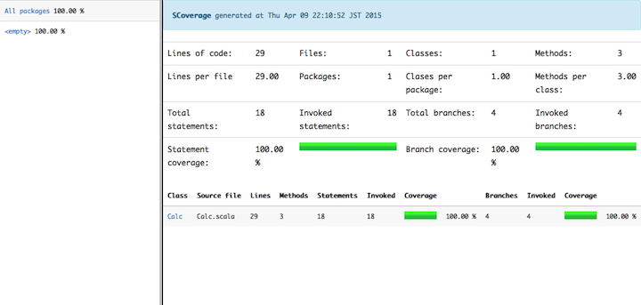

# テスト

ソフトウェアをテストすることは多くの開発者が必要なことだと認識していますが、テストという言葉の定義は各人で異なり話が噛み合わない、という状況が多々発生します。
このような状況に陥る原因の多くは人や組織、開発するソフトウェアによってコンテキストが異なるにもかかわらず、言葉の定義について合意形成せずに話し始めるためです。

言葉に食い違いがある状態で会話をしても不幸にしかなりません。
世の開発者全員で合意することは不可能かもしれませんが、プロジェクト内ではソフトウェアテストという言葉の定義について合意を形成しましょう。
また、新しくプロジェクトに配属された場合は定義を確認しておきましょう。

本章では、ソフトウェアテストを下記の定義とします。
この定義は古典と呼ばれている書籍『[ソフトウェアテストの技法　第二版](https://www.amazon.co.jp/dp/4764903296)』をベースにしたものです。

> ソフトウェアテストとは、ソフトウェアが意図されたように動作し意図されないことは全て実行されないように設計されていることを検証するように設計されたプロセス、あるいは一連のプロセスである。

限られたリソースの中でうまくバグを発見できるテストを設計するためには、プロジェクトの仕様、採用した技術、開発の目的を理解する必要があります。
こういった知識を得てこそ何を、なぜ、どのように検証するか考えられるようになります。
そうして考えられた計画を用いて対象のソフトウェアを検証することが、テストという行為なのです。

## テストの分類

テストは幾つかのグループに分類できますが、分類方法についても書籍、組織、チームによってその定義は様々です。
プロジェクトに携わる際は、どういった定義でテストを分類しているか確認しておきましょう。
参考までに、いくつかの分類例を示します。

- [実践テスト駆動開発](http://www.shoeisha.co.jp/book/detail/9784798124582)での定義
  - ユニットテスト
    - オブジェクトは正しく振る舞っているか、またオブジェクトが扱いやすいかどうかをテストします。
  - インテグレーションテスト
    - 変更できないコードに対して、書いたコードが機能するかテストします。
  - 受け入れテスト
    - システム全体が機能するかテストします。
- JSTQB　ソフトウェアテスト標準用語集[^jstqb]での定義
  - コンポーネントテスト（component testing）
    - `ユニットテスト`とも呼びます。
    - 個々のソフトウェアコンポーネントのテストを指します。
    - 独立してテストできるソフトウェアの最小単位をコンポーネントと呼びます。
  - 統合テスト
    - 統合したコンポーネントやシステムのインタフェースや相互作用の欠陥を摘出するためのテストです。
  - システムテスト
    - 統合されたシステムが、特定の要件を満たすことを実証するためのテストのプロセスです。
  - 受け入れテスト
    - システムがユーザのニーズ、要件、ビジネスプロセスを満足するかをチェックするためのテストです。
    - このテストによって、システムが受け入れ基準を満たしているか判定したり、ユーザや顧客がシステムを受け入れるかどうかを判定できます。
- 本テキストの初期執筆時に書かれていた定義
  - ユニットテスト（Unit Test）
    - `単体テスト`とも呼びます。
    - プログラム全体ではなく小さな単位（例えば関数ごと）に実行されます。このテストの目的はその単体が正しく動作していることを確認することです。ユニットテスト用のフレームワークの種類はとても多くJavaのJUnitやPHPのPHPUnitなどxUnitと呼ばれることが多いです。
  - 結合テスト・統合テスト (Integration Test)
    - プログラム全体が完成してから実際に動作するかを検証するために実行します。人力で行う（例えば機能を開発した本人）ものやSeleniumなどを使って自動で実行するものがあります。
  - システムテスト・品質保証テスト (System Test)
    - 実際に利用される例に則した様々な操作を行い問題ないかを確認します。ウェブアプリケーションの場合ですと、例えばフォームに入力する値の境界値を超えた場合、超えない場合のレスポンスの検証を行ったり様々なウェブブラウザで正常に動作するかなどを確認します。

共通しているのは、分類ごとにテストの目的や粒度が異なること、どのような分類にせよ数多くのテストを通過する必要があることです。

## ユニットテスト

ここでは、ユニットテストを`小さな単位で自動実行できるテスト`と定義して、ユニットテストにフォーカスして解説を行います。
ユニットテストはScalaでのプログラミングにも密接に関わってくるためです。

ユニットテストを行う理由は大きく3つあげられます。

1. 実装の前に満たすべき仕様をユニットテストとして定義し、実装を行うことで要件漏れのない機能を実装することができる
1. ユニットテストによって満たすべき仕様がテストされた状態ならば、安心してリファクタリングすることができる
1. 全ての機能を実装する前に、単体でテストをすることができる

最初の理由であるテストコードをプロダクトコードよりも先に書くことをテストファーストと呼びます。
そして、失敗するテストを書きながら実装を進めていく手法のことをテスト駆動開発（TDD: Test Driven Development）といいます。
なお、TDDについてはそれ単独で章になり得るので本節では解説しません。

リファクタリングについては、次節で詳しく触れます。

ユニットテストを実装するにあたって、気をつけておきたいことが二点あります。

1. 高速に実行できるテストを実装する
1. 再現性のあるテストを実装する

高速に実行できることでストレスなくユニットテストを実行できるようになります。
また、再現性を確保することでバグの原因特定を容易にできます。

## リファクタリング

リファクタリングとは、ソフトウェアの仕様を変えること無く、プログラムの構造を扱いやすく変化させることです。

マーチン・ファウラーの[リファクタリング](https://www.amazon.co.jp/dp/427405019X)では、リファクタリングを行う理由として4つの理由が挙げられています。

1. ソフトウェア設計を向上させるため
1. ソフトウェアを理解しやすくするため
1. バグを見つけやすくするため
1. 早くプログラミングできるようにするため

また同書の中でTDDの提唱者であるケント・ベックは、以下に示す経験則から、リファクタリングは有効であると述べています。

1. 読みにくいプログラムは変更しにくい
1. ロジックが重複しているプログラムは変更しにくい
1. 機能追加に伴い、既存のコード修正が必要になるプログラムは変更しにくい
1. 複雑な条件分岐の多いプログラムは変更しにくい

リファクタリングは中長期的な開発の効率をあげるための良い手段であり、変更が要求されるソフトウェアでは切っても切ることができないプラクティスです。
そしてリファクタリングを行う際に、ソフトウェアの仕様を変えなかったことを確認する手段としてユニットテストが必要になるのです。

## テスティングフレームワーク

実際にユニットテストのテストコードを書く際には、テスティングフレームワークを利用します。
Scalaで広く利用されているテスティングフレームワークとして紹介されるのは以下の2つです。

- [Specs2](https://etorreborre.github.io/specs2/)
- [ScalaTest](http://www.scalatest.org/)

今回は、マクロを用いて実装されているpower assertという便利な機能を使いたいため、ScalaTestを利用します[^power-assert]。

ScalaTestは、テスティングフレームワークの中でも
振舞駆動開発（BDD :Behavior Driven Development）をサポートしているフレームワークです。
BDDでは、テスト内にそのプログラムに与えられた機能的な外部仕様を記述させることで、
テストが本質的に何をテストしようとしているのかをわかりやすくする手法となります。
基本この書き方に沿って書いていきます。

## テストができるsbtプロジェクトの作成

では、実際にユニットテストを書いてみましょう。
まずはプロジェクトを作成します。

適当な作業フォルダにて以下を実行します。ここでは、`scalatest_study`を作り、
さらに中に`src/main/scala`と`src/test/scala`の2つのフォルダを作りましょう。

`build.sbt`を用意して、以下を記述しておきます。

```scala
name := "scalatest_study"

version := "1.0"

scalaVersion := "2.13.2"

libraryDependencies += "org.scalatest" %% "scalatest" % "3.2.0" % "test"

```

その後、`scalatest_study`フォルダ内で、`sbt compile`を実行してみましょう。

```
[info] Set current project to scalatest_study (in build file:/Users/dwango/workspace/scalatest_study/scalatest_study/)
[info] Updating {file:/Users/dwango/workspace/scalatest_study/scalatest_study/}scalatest_study...
[info] Resolving jline#jline;2.12.1 ...
[info] downloading https://repo1.maven.org/maven2/org/scalatest/scalatest_2.13/3.2.0/scalatest_2.13-3.2.0.jar ...
[info] 	[SUCCESSFUL ] org.scalatest#scalatest_2.13;3.2.0!scalatest_2.13.jar(bundle) (10199ms)
[info] Done updating.
[success] Total time: 11 s, completed 2015/04/09 16:48:42
```

以上のように表示されれば、これで準備は完了です。

## Calcクラスとそのテストを実際に作る

それでは、具体的なテストを実装してみましょう。
下記の仕様を満たすCalcクラスを作成し、それらをテストしていきます。

- 整数の配列を取得し、それらを足し合わせた整数を返すことができるsum関数を持つ
- 整数を2つ受け取り、分子を分母で割った浮動小数点の値を返すことができるdiv関数を持つ
- 整数値を1つ受け取り、その値が素数であるかどうかのブール値を返すisPrime関数を持つ

これを実装した場合、`src/main/scala/Calc.scala`は以下のようになります。

```scala mdoc:nest:silent
class Calc {

  /** 整数の配列を取得し、それらを足し合わせた整数を返す
    *
    * Intの最大を上回った際にはオーバーフローする
    */
  def sum(seq: Seq[Int]): Int = seq.foldLeft(0)(_ + _)

  /** 整数を2つ受け取り、分子を分母で割った浮動小数点の値を返す
    *
    * 0で割ろうとした際には実行時例外が投げられる
    */
  def div(numerator: Int, denominator: Int): Double = {
    if (denominator == 0) throw new ArithmeticException("/ by zero")
    numerator.toDouble / denominator.toDouble
  }

  /** 整数値を一つ受け取り、その値が素数であるかどうかのブール値を返す */
  def isPrime(n: Int): Boolean = {
    if (n < 2) false else !((2 to Math.sqrt(n).toInt) exists (n % _ == 0))
  }
}
```

次にテストケースについて考えます。

- sum関数
    - 整数の配列を取得し、それらを足し合わせた整数を返すことができる
    - Intの最大を上回った際にはオーバーフローする
- div関数
    - 整数を2つ受け取り、分子を分母で割った浮動小数点の値を返す
    - 0で割ろうとした際には実行時例外が投げられる
- isPrime関数
    - その値が素数であるかどうかのブール値を返す
    - 1000万以下の値の素数判定を一秒以内で処理できる

以上のようにテストを行います。
基本的にテストの設計は、

1. 機能を満たすことをテストする
1. 機能が実行できる境界値に対してテストする
1. 例外やログがちゃんと出ることをテストする

以上の考えが重要です。

XP（エクストリームプログラミング）のプラクティスに、不安なところを徹底的にテストするという考えがあり、基本それに沿います。

ひとつ目の満たすべき機能が当たり前に動くは当たり前のこととして、
2つ目の不安な要素のある境界値をしっかりテストする、というのは
テストするケースを減らし、テストの正確性をあげるためのプラクティスの境界値テストとしても知られています。
そして最後は、レアな事象ではあるけれど動かないと致命的な事象の取り逃しにつながる
例外やログについてテストも非常に重要なテストです。
このような例外やログにテストがないと例えば1か月に1度しか起こらないような
不具合に対する対処が原因究明できなかったりと大きな問題につながってしまいます。

最小のテストを書いてみます。`src/test/scala/CalcSpec.scala`を以下のように記述します。

```scala mdoc:nest:silent
import org.scalatest.flatspec.AnyFlatSpec
import org.scalatest.diagrams.Diagrams

class CalcSpec extends AnyFlatSpec with Diagrams {

  val calc = new Calc

  "sum関数" should "整数の配列を取得し、それらを足し合わせた整数を返すことができる" in {
    assert(calc.sum(Seq(1, 2, 3)) === 6)
    assert(calc.sum(Seq(0)) === 0)
    assert(calc.sum(Seq(-1, 1)) === 0)
    assert(calc.sum(Seq()) === 0)
  }

  it should "Intの最大を上回った際にはオーバーフローする" in {
    assert(calc.sum(Seq(Integer.MAX_VALUE, 1)) === Integer.MIN_VALUE)
  }
}
```

テストクラスに`Diagrams`をミックスインし、`assert`メソッドの引数に期待する条件を記述していきます[^predef-assert]。
`Diagrams`を使うことで、覚えるべきAPIを減らしつつテスト失敗時に多くの情報を表示できるようになります。

テストを実装したら`sbt test`でテストを実行してください。
以下のような実行結果が表示されます。

```
[info] Loading project definition from /Users/dwango/workspace/scalatest_study/project
[info] Set current project to scalatest_study (in build file:/Users/dwango/workspace/scalatest_study/)
[info] Compiling 1 Scala source to /Users/dwango/workspace/scalatest_study/target/scala-2.13/classes...
[info] Compiling 1 Scala source to /Users/dwango/workspace/scalatest_study/target/scala-2.13/test-classes...
[info] CalcSpec:
[info] sum関数
[info] - should 整数の配列を取得し、それらを足し合わせた整数を返すことができる
[info] - should Intの最大を上回った際にはオーバーフローする
[info] Run completed in 570 milliseconds.
[info] Total number of tests run: 2
[info] Suites: completed 1, aborted 0
[info] Tests: succeeded 2, failed 0, canceled 0, ignored 0, pending 0
[info] All tests passed.
[success] Total time: 12 s, completed 2015/12/25 1:25:56
```

実行結果から、すべてのテストに成功したことを確認できます。
なお、わざと失敗した場合にはどのように表示されるのか確認してみましょう。

```
[info] Loading project definition from /Users/dwango/workspace/scalatest_study/project
[info] Set current project to scalatest_study (in build file:/Users/dwango/workspace/scalatest_study/)
[info] Compiling 1 Scala source to /Users/dwango/workspace/scalatest_study/target/scala-2.13/test-classes...
[info] CalcSpec:
[info] sum関数
[info] - should 整数の配列を取得し、それらを足し合わせた整数を返すことができる *** FAILED ***
[info]   assert(calc.sum(Seq(1, 2, 3)) === 7)
[info]          |    |  ||   |  |  |   |   |
[info]          |    6  ||   1  2  3   |   7
[info]          |       |List(1, 2, 3) false
[info]          |       6
[info]          Calc@e72a964 (CalcSpec.scala:8)
[info] - should Intの最大を上回った際にはオーバーフローする
[info] Run completed in 288 milliseconds.
[info] Total number of tests run: 2
[info] Suites: completed 1, aborted 0
[info] Tests: succeeded 1, failed 1, canceled 0, ignored 0, pending 0
[info] *** 1 TEST FAILED ***
[error] Failed tests:
[error] 	CalcSpec
[error] (test:test) sbt.TestsFailedException: Tests unsuccessful
[error] Total time: 7 s, completed 2015/12/25 1:39:59
```

どこがどのように間違ったのかを指摘してくれます。

次に、例外が発生することをテストする場合について記述してみましょう。
div関数までテストの実装を進めます。

```scala mdoc:nest:silent
import org.scalatest.flatspec.AnyFlatSpec
import org.scalatest.diagrams.Diagrams

class CalcSpec extends AnyFlatSpec with Diagrams {

  val calc = new Calc

  // ...

  "div関数" should "整数を2つ受け取り、分子を分母で割った浮動小数点の値を返す" in {
    assert(calc.div(6, 3) === 2.0)
    assert(calc.div(1, 3) === 0.3333333333333333)
  }

  it should "0で割ろうとした際には実行時例外が投げられる" in {
    intercept[ArithmeticException] {
      calc.div(1, 0)
    }
  }
}
```

上記では最後の部分でゼロ除算の際に投げられる例外をテストしています。
`intercept[Exception]`という構文で作ったスコープ内で投げられる例外がある場合には成功となり、
例外がない場合には逆にテストが失敗します。

最後にパフォーマンスを保証するテストを書きます。
なお、本来ユニットテストは時間がかかるテストを書くべきではありませんが、
できるだけ短い時間でそれを判定できるように実装します。

```scala mdoc:nest:silent
import org.scalatest.flatspec.AnyFlatSpec
import org.scalatest.diagrams.Diagrams
import org.scalatest.concurrent.TimeLimits
import org.scalatest.time.SpanSugar._

class CalcSpec extends AnyFlatSpec with Diagrams with TimeLimits {

  val calc = new Calc

  // ...

  "isPrime関数" should "その値が素数であるかどうかのブール値を返す" in {
    assert(calc.isPrime(0) === false)
    assert(calc.isPrime(-1) === false)
    assert(calc.isPrime(2))
    assert(calc.isPrime(17))
  }

  it should "1000万以下の値の素数判定を一秒以内で処理できる" in {
    failAfter(1000 millis) {
      assert(calc.isPrime(9999991))
    }
  }
}
```

`TimeLimits`というトレイトを利用することで`failAfter`という処理時間を
テストする機能を利用できるようになります。

最終的に全てのテストをまとめて`sbt test`で実行すると以下の様な出力が得られます。

```
[info] Loading project definition from /Users/dwango/workspace/scalatest_study/project
[info] Set current project to scalatest_study (in build file:/Users/dwango/workspace/scalatest_study/)
[info] Compiling 1 Scala source to /Users/dwango/workspace/scalatest_study/target/scala-2.13/test-classes...
[info] CalcSpec:
[info] sum関数
[info] - should 整数の配列を取得し、それらを足し合わせた整数を返すことができる
[info] - should Intの最大を上回った際にはオーバーフローする
[info] div関数
[info] - should 整数を2つ受け取り、分子を分母で割った浮動小数点の値を返す
[info] - should 0で割ろうとした際には実行時例外が投げられる
[info] isPrime関数
[info] - should その値が素数であるかどうかのブール値を返す
[info] - should 1000万以下の値の素数判定を一秒以内で処理できる
[info] Run completed in 280 milliseconds.
[info] Total number of tests run: 6
[info] Suites: completed 1, aborted 0
[info] Tests: succeeded 6, failed 0, canceled 0, ignored 0, pending 0
[info] All tests passed.
[success] Total time: 8 s, completed 2015/12/25 1:43:22
```

以上が基本的なテストを実装するための機能の紹介でした。
BDDでテストを書くことによってテストによってどのような仕様が満たされた状態であるのかというのが
わかりやすい状況になっていることがわかります。

## モック

モックとは、テストをする際に必要となるオブジェクトを偽装して用意できる機能です。
以下の様なモックライブラリが存在しています。

- [ScalaMock](http://scalamock.org/)
- [EasyMock](http://easymock.org/)
- [JMock](http://jmock.org/)
- [Mockito](https://github.com/mockito/mockito)

ここでは、よく使われているMockitoを利用してみましょう。
`build.sbt`に以下を追記することで利用可能になります。

```scala
libraryDependencies += "org.mockito" % "mockito-core" % "3.4.3" % "test"
```

せっかくなので、先ほど用意したCalcクラスのモックを用意して、モックにsumの振る舞いを仕込んで見ましょう。

```scala mdoc:nest:silent
import org.scalatest.time.SpanSugar._
import org.scalatest.flatspec.AnyFlatSpec
import org.scalatest.diagrams.Diagrams
import org.scalatest.concurrent.TimeLimits
import org.mockito.Mockito._

class CalcSpec extends AnyFlatSpec with Diagrams with TimeLimits {

  // ...

  "Calcのモックオブジェクト" should "振る舞いを偽装することができる" in {
    val mockCalc = mock(classOf[Calc])
    when(mockCalc.sum(Seq(3, 4, 5))).thenReturn(12)
    assert(mockCalc.sum(Seq(3, 4, 5)) === 12)
  }
}
```

`val mockCalc = mock(classOf[Calc])`でモックオブジェクトを作成し、
`when(mockCalc.sum(Seq(3, 4, 5)).thenReturn(12)`で振る舞いを作成しています。

そして最後に、`assert(mockCalc.sum(Seq(3, 4, 5)) === 12)`でモックに仕込んだ偽装された振る舞いをテストしています。

以上のようなモックの機能は、実際には時間がかかってしまう通信などの部分を高速に動かすために利用されています。

モックを含め、テストの対象が依存しているオブジェクトを置き換える代用品の総称をテストダブル[^xutp]と呼びます。

## コードカバレッジの測定

テストを行った際に、テストが機能のどれぐらいを網羅できているのかを知る方法として、
コードカバレッジを計測するという方法があります。
ここでは、[scoverage](https://github.com/scoverage/scalac-scoverage-plugin)を利用します。

**scoverageは現在最新のScalaで動かない問題があります<https://github.com/scala-text/scala_text/issues/553>。**

過去、[SCCT](http://mtkopone.github.io/scct/)というプロダクトがあったのですが紆余曲折あり、
今はあまりメンテンナンスされていません。

`project/plugins.sbt` に以下のコードを記述します。

```scala
resolvers += Classpaths.sbtPluginReleases

addSbtPlugin("org.scoverage" % "sbt-scoverage" % "1.5.1")
```

その後、`sbt clean coverage test coverageReport`を実行することで、`target/scala-2.13/scoverage-report/index.html`にレポートが出力されます。



以上の出力から、今回のテストはカバレッジ100％であることがわかります。

ここで、カバレッジを計測することについて注意点を述べておきます。

得られたカバレッジはあくまで”そのカバレッジツールによって得られた数値”でしかありません。
数値自体が絶対的な評価を表しているわけではなく、書かれたプロダクトコードに対して、テストコードがN％カバーしているという事実を示しているだけです。
カバレッジはツールや測定手法によって結果が変動します。
例えばJavaScript用のカバレッジツールであるistanbulは[totalが0件の場合100%と表示します](https://github.com/gotwarlost/istanbul/blob/v0.4.3/lib/object-utils.js#L93)が、これは単にツールの実装がそうなっているというだけの話です。

利用しているカバレッジツールがどのように動作するのか把握した上で、カバレッジレポートからどのコードが実行されなかったのか情報収集しましょう。
数値だけに目を向けるのではなく、カバレッジ測定によってどういった情報が得られたのかを考えてください。
そうすれば、ツールに振り回されることなくテストの少ない部分を発見できるでしょう。

## コードスタイルチェック

なおテストとは直接は関係ありませんが、ここまでで紹介したテストは、
実際にはJenkinsなどの継続的インテグレーションツール（CIツール）で実施され、
リグレッションを検出するためにつかわれます。
その際に、CIの一環として一緒に行われることが多いのがコードスタイルチェックです。

ここでは、[ScalaStyle](http://www.scalastyle.org/sbt.html)を利用します。

使い方は、`project/plugins.sbt` に以下のコードを記述します。

```scala
addSbtPlugin("org.scalastyle" %% "scalastyle-sbt-plugin" % "1.0.0")
```

その後、`sbt scalastyleGenerateConfig`を一度だけ実施後、`sbt scalastyle`を実行します。

実行すると、下記のように警告が表示されます。

```
[info] Loading project definition from /Users/dwango/workspace/scalatest_study/project
[info] Set current project to scalatest_study (in build file:/Users/dwango/workspace/scalatest_study/)
[info] scalastyle using config /Users/dwango/workspace/scalatest_study/scalastyle-config.xml
[warn] /Users/dwango/workspace/scalatest_study/src/main/scala/Calc.scala:1: Header does not match expected text
[info] Processed 1 file(s)
[info] Found 0 errors
[info] Found 1 warnings
[info] Found 0 infos
[info] Finished in 12 ms
[success] created output: /Users/dwango/workspace/scalatest_study/target
[success] Total time: 1 s, completed 2015/04/09 22:17:40
```

これはヘッダに特定のテキストが入っていないというルールに対して警告を出してくれているもので、
`scalastyle-config.xml`でルール変更を行うことができます。
なおデフォルトの設定では、Apacheライセンスの記述を入れなくては警告を出す設定になっています。
これらもテスティングフレームワークやカバレッジ測定と同時に導入、設定してしまいましょう。

## テストを書こう

開発者として意識してほしいことを挙げておきます。

- 不具合を見つけたら、可能であれば再現手順もあわせて報告する
- パッチを送る際はテストを含める
- [不具合にテストを書いて立ち向かう](http://t-wada.hatenablog.jp/entry/debugging-tests)

他人から報告された不具合は、伝聞ということもありどうしても再現させづらい場合があります。
その結果として「私の環境では再現しませんでした」と言われて終わってしまうのでは、不具合を修正するせっかくのチャンスを逃すことになってしまいます。
そんな状況を回避するためにも、可能であれば不具合の再現手順や再現コードを用意し、不具合報告に含めましょう。
再現手順を元に素早く不具合が修正される可能性が高まります。

他人のコードをテストするのは、ちょっとしたコードであっても骨の折れる作業です。
そんな作業を、限られたリソースですべてのパッチに対して行うのは不可能に近いので、プロジェクトによってはテストコードのないパッチはレビュー対象から外すことが多いです。
パッチを送る場合は相手側が自信を持ってパッチを取り込めるよう、テストを含めておきましょう。

[^jstqb]: http://www.jstqb.jp/dl/JSTQB-glossary.V2.3.J02.pdf
[^power-assert]: 渡された条件式の実行過程をダイアグラムで表示する`assert`は、一般に“power assert”と呼ばれています
[^predef-assert]: Scalaには`Predef`にも`assert`が存在しますが、基本的に使うことはありません
[^xutp]: モック以外の仕組みについては[xUnit Test Patterns](http://xunitpatterns.com/)を参照してください
